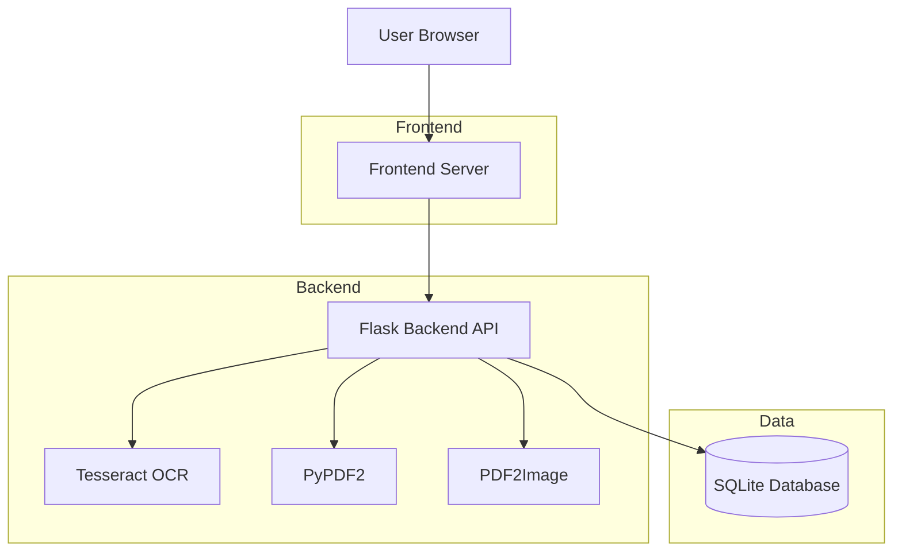
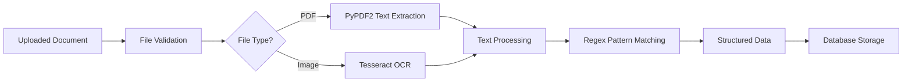
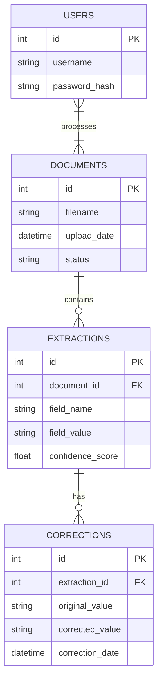

# InvoiceExtractor Architecture

## System Overview



## Component Details

### 1. Frontend Layer
- **Technology**: HTML, CSS, Vanilla JavaScript
- **Components**:
  - Login Page
  - Upload Interface (Drag & Drop)
  - Results Display
  - History View
  - Export Functionality

### 2. Backend Layer
- **Technology**: Python Flask
- **Components**:
  - REST API Endpoints
  - Document Processing Pipeline
  - Database Operations
  - Authentication System

### 3. Processing Pipeline


### 4. Data Flow

1. **User Uploads Document**
   - Frontend sends file to `/api/upload`
   - Backend validates file type and size

2. **Document Processing**
   - PDF files: Extract text directly, fallback to OCR if needed
   - Image files: Process with Tesseract OCR
   - Apply regex patterns to extract invoice fields

3. **Data Storage**
   - Store document metadata in `documents` table
   - Store extracted fields in `extractions` table
   - Track user corrections in `corrections` table

4. **Results Presentation**
   - Frontend fetches data from `/api/results/{id}`
   - User can edit and save corrections
   - Export options for JSON/CSV formats

5. **History Tracking**
   - All processed documents stored in database
   - Accessible via `/api/history` endpoint

## Database Schema



## API Endpoints

```mermaid
graph LR
    A[POST /api/upload] --> B[Upload Document]
    C[GET /api/results/{id}] --> D[Get Extraction Results]
    E[POST /api/correct/{id}] --> F[Save Corrections]
    G[GET /api/history] --> H[View Processing History]
    I[POST /api/login] --> J[User Authentication]
    K[GET /api/export/{id}/{format}] --> L[Export Data]
```

## Security Considerations

1. **File Validation**: 
   - Type checking (PDF, JPG, PNG)
   - Size limits (5MB)
   - Sanitization of filenames

2. **Authentication**:
   - Hashed password storage
   - Session management (future enhancement)

3. **Input Validation**:
   - API parameter validation
   - Error handling for malformed requests

4. **CORS Protection**:
   - Configured for same-origin requests
   - Can be adjusted for production deployment

## Scalability Considerations

1. **Database**: 
   - SQLite suitable for single-user applications
   - Can be upgraded to PostgreSQL/MySQL for multi-user deployments

2. **Processing**:
   - Synchronous processing suitable for small workloads
   - Can be enhanced with task queues (Celery) for heavy workloads

3. **Storage**:
   - Local file storage suitable for development
   - Can integrate with cloud storage (AWS S3, Google Cloud Storage) for production

4. **Caching**:
   - Results can be cached to improve response times
   - Implement Redis/Memcached for better performance